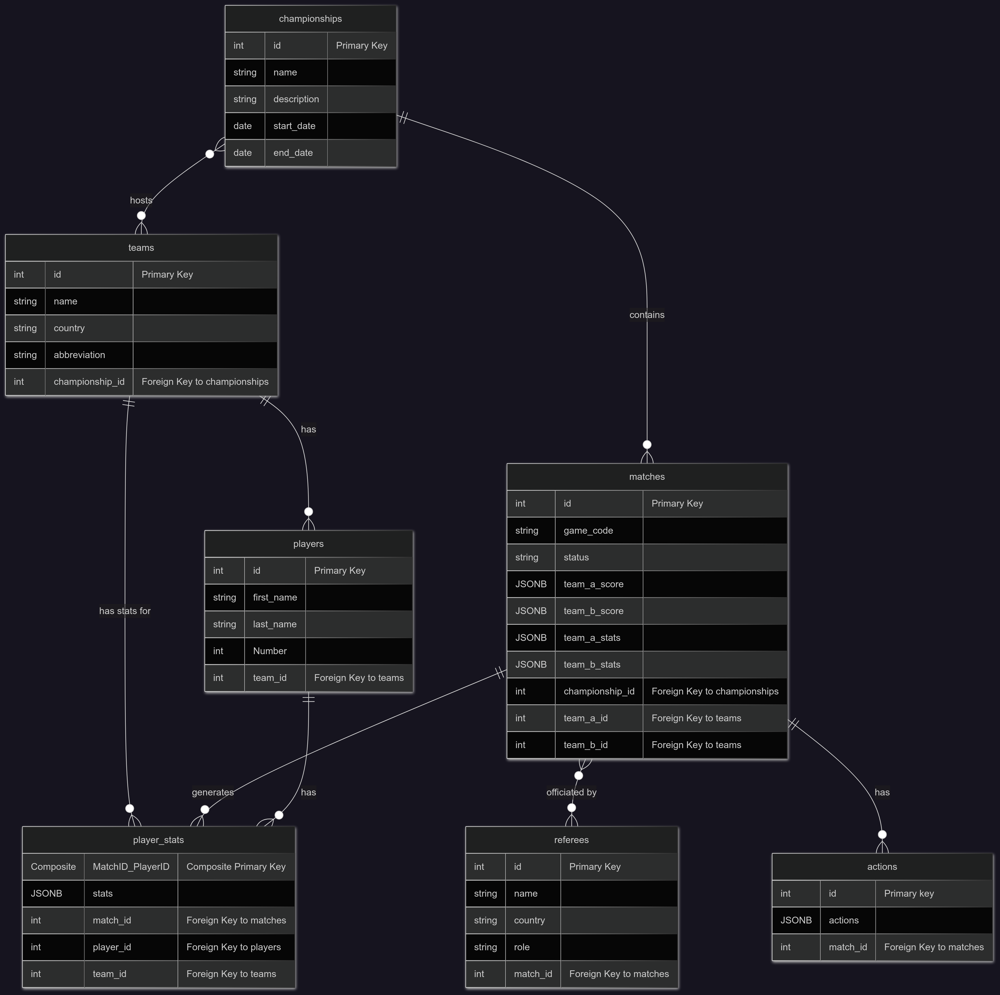

# IHF Championship Data Management System

This project is a backend system designed to manage data for handball championships, including teams, players, matches, and detailed play-by-play actions. It utilizes a hybrid database approach to efficiently handle both structured relational data and high-volume, semi-structured event data.

## Features

*   **User Authentication:** Secure user registration and login with JWT-based authentication.
*   **Championship Management:** Create, retrieve, and manage championship details.
*   **Team Management:** Create, retrieve, and manage team information.
*   **Match Management:** Store and retrieve match details, scores, and statistics.
*   **Player Management:** Manage player information and their statistics within matches.
*   **CP File Parsing:** Automated parsing of `.CP` files to extract championship, match, and detailed play-by-play action data.
*   **Play-by-Play Actions:** Efficient storage and retrieval of granular match actions (e.g., goals, assists, fouls) in a NoSQL database.

## Technologies Used

*   **Backend Framework:** FastAPI (Python)
*   **Relational Database:** PostgreSQL
*   **NoSQL Database:** MongoDB
*   **ORM (Relational):** SQLAlchemy
*   **Database Migrations:** (Assumed, based on project structure, but not explicitly seen in provided files)
*   **Authentication:** JWT (JSON Web Tokens)
*   **Environment Management:** `python-dotenv`
*   **Data Parsing:** Custom parser for `.CP` files

## Setup Instructions

### 1. Clone the Repository

```bash
git clone <repository_url>
cd ihf
```

### 2. Set up Environment Variables

Create a `.env` file in the root directory of the project based on the `.env.example` file. This file will contain your database connection strings and other sensitive information.

```ini
MONGODB_URI=your_mongodb_uri
MONGODB_DB=your_mongodb_db_name

SECRET_KEY="your_secret_key"

DB_HOST=your_db_host
DB_NAME=your_db_name
DB_USER=your_db_user
DB_PASS=your_db_password
```

*   Replace placeholders with your actual database credentials and a strong secret key.

### 3. Install Dependencies

It is recommended to use a virtual environment.

```bash
python -m venv venv
source venv/bin/activate  # On Windows: .\venv\Scripts\activate
pip install -r requirements.txt
```

### 4. Database Setup

#### PostgreSQL (Relational Database)

Ensure your PostgreSQL server is running and accessible with the credentials provided in your `.env` file. The database schema is defined in `schema.png` and is managed by SQLAlchemy.

#### MongoDB (NoSQL Database)

Ensure your MongoDB instance is running and accessible. The `pbp_collection` will be automatically created when data is first inserted.

### 5. Run the Application

```bash
cd app
uvicorn main:app --reload
```

The API will be accessible at `http://127.0.0.1:8000` (or similar, depending on your Uvicorn configuration).

## API Endpoints Overview

*   **Authentication:**
    *   `POST /auth/register`: Register a new user.
    *   `POST /auth/login`: Log in and receive an access token.
*   **Championships:**
    *   `GET /championships`: Get all championships.
    *   `GET /championships/{championship_id}`: Get championship by ID.
    *   `GET /championships/name/{championship_name}`: Get championship by name.
    *   `POST /championships`: Create a new championship.
    *   `POST /championships/{championship_name}/upload-cp-file/`: Upload and process a `.CP` file for a specific championship.
*   **Teams:**
    *   `GET /teams`: Get all teams.
    *   `GET /teams/{team_id}`: Get team by ID.
    *   `GET /teams/abbreviation/{abbreviation}`: Get team by abbreviation.
    *   `POST /teams`: Create a new team.
*   **Matches:**
    *   `GET /matches/{match_id}/score`: Get match score.
    *   `GET /matches/{match_id}/stats`: Get match statistics.
    *   `GET /matches/{match_id}/referees`: Get referees for a match.
*   **Players:**
    *   `GET /teams/{team_id}/players`: Get players by team.
    *   `GET /matches/{match_id}/teams/{team_id}/players/stats`: Get player stats for a team in a match.
    *   `GET /matches/{match_id}/players/stats`: Get all player stats in a match.
    *   `GET /matches/{match_id}/teams/{team_id}/players/{player_id}/stats`: Get specific player stats in a match.
*   **Play-by-Play Actions:**
    *   `GET /PlayByPlay/matches/{match_id}/page/{page_no}`: Get paginated play-by-play actions for a match.

## Database Schema

The relational database schema for PostgreSQL is visually represented below:



## Contributing

Contributions are welcome! Please follow these steps:

1.  Fork the repository.
2.  Create a new branch (`git checkout -b feature/your-feature-name`).
3.  Make your changes.
4.  Commit your changes (`git commit -m 'Add some feature'`).
5.  Push to the branch (`git push origin feature/your-feature-name`).
6.  Open a Pull Request.


